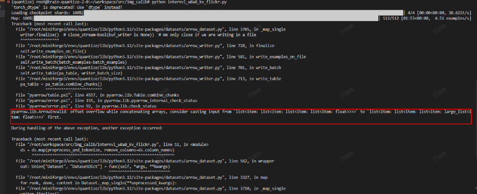
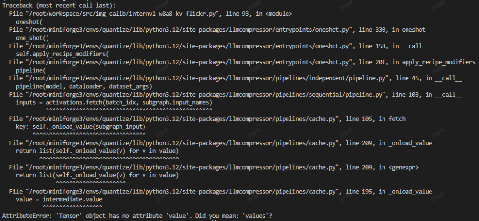

# 0、环境信息
- nvidia L40
- python 3.12
- llmcompressor 0.8.1
- transformers 4.56.2
- torch 2.8.0
- torchvision 0.23.0

# 一、convert to hf format
InternVL 提供了两种模型权重的格式，包括和前几代权重格式一致的 [GitHub 格式](https://huggingface.co/OpenGVLab/InternVL3_5-GPT-OSS-20B-A4B-Preview#github-format)以及和`transformers`库格式一致的 [HuggingFace 格式](https://huggingface.co/OpenGVLab/InternVL3_5-GPT-OSS-20B-A4B-Preview#huggingface-format)。
量化建议使用 hf 格式，因为笔者所使用的模型为基于 Github 格式微调过的，所以要先将其转为 hf 格式再量化。
InternVL官方有提供转换脚本 [internvl_custom2hf.py](https://github.com/OpenGVLab/InternVL/blob/main/internvl_chat/tools/internvl_custom2hf.py)
```
python custom2hf.py 
    --custom_path /root/workspace/models/InternVL3-8B/ 
    --hf_path /root/workspace/models/InternVL3-8B-hf 
    --save_path /root/workspace/models/InternVL3-8B-hf-1
```
这里有个问题，转换后的 `InternVL3-8B-hf-1`路径下面并不像 `InternVL3-8B-hf`下有 `preprocessor_config.json` 和 `processor_config.json` 文件，笔者是将`InternVL3-8B-hf`下的文件拷贝过来，感觉脚本功能不完善。

下面均以量化 `InternVL3-8B-hf` 为例。
# 二、动手量化
## 2.1 使用文本校准数据集
### 2.1.1 量化相关配置
- 1、Load Model
```
model_id = "/root/workspace/models/InternVL3-8B-hf"
model = AutoModelForImageTextToText.from_pretrained(model_id, torch_dtype=torch.bfloat16)
processor = AutoProcessor.from_pretrained(model_id)
```
- 2、Load Datasets
```
DATASET_ID = "/root/workspace/datasets/ultrachat_200k"
DATASET_SPLIT = "train_sft"
NUM_CALIBRATION_SAMPLES = 256
MAX_SEQUENCE_LENGTH = 512
ds = load_dataset(DATASET_ID, split=f"{DATASET_SPLIT}[:{NUM_CALIBRATION_SAMPLES}]")
ds = ds.shuffle(seed=42)
```
- 3、Preprocess and Tokenize
```
def preprocess_and_tokenize(example):
    messages = [
        {
            "role": "user",
            "content": [
                {
                    "type": "text", 
                    "text":  example["messages"]
                },
            ],
        }
    ]

    inputs = processor.apply_chat_template(messages, add_generation_prompt=True, tokenize=True, return_dict=True, return_tensors="pt")
    return inputs

ds = ds.map(preprocess_and_tokenize)
```
- 4、Define data_collator
```
def data_collator(batch):
    assert len(batch) == 1
    item = {key: value for key, value in batch[0].items()}
    #item["pixel_values"] =  torch.tensor([item["pixel_values"]]),
    item["attention_mask"] = torch.tensor([item["attention_mask"]])
    item["input_ids"] = torch.LongTensor([item["input_ids"]])

    return item
```
- 5、Define Recipe

这里采用FP8 W8A8 + FP8 KV cache 的量化方案，注意这里的 ignore 的配置。
```
recipe = """
quant_stage:
    quant_modifiers:
        QuantizationModifier:
            ignore: ["re:.*lm_head",  "re:.*vision_tower.*",  "re:.*multi_modal_projector.*"]
            config_groups:
                group_0:
                    weights:
                        num_bits: 8
                        type: float
                        strategy: tensor
                        dynamic: false
                        symmetric: true
                    input_activations:
                        num_bits: 8
                        type: float
                        strategy: tensor
                        dynamic: false
                        symmetric: true
                    targets: ["Linear"]
            kv_cache_scheme:
                num_bits: 8
                type: float
                strategy: tensor
                dynamic: false
                symmetric: true
"""
```
- 6、Oneshot and Save
```
oneshot(
    model=model,
    tokenizer=model_id,
    dataset=ds,
    recipe=recipe,
    max_seq_length=MAX_SEQUENCE_LENGTH,
    num_calibration_samples=NUM_CALIBRATION_SAMPLES,
    trust_remote_code_model=True,
    data_collator=data_collator
)

SAVE_DIR = "/root/workspace/models/InternVL3-8B-hf-FP8-W8A8-FP8-KV-ultrachat"
model.save_pretrained(SAVE_DIR, save_compressed=True)
processor.save_pretrained(SAVE_DIR)
```
## 2.2 使用图片校准数据集
### 2.2.1 量化相关配置
- 1、Load Model
```
model_id = "/root/workspace/models/InternVL3-8B-hf"
model = AutoModelForImageTextToText.from_pretrained(model_id, torch_dtype=torch.bfloat16)
processor = AutoProcessor.from_pretrained(model_id)
```
- 2、Load Datasets
```
DATASET_ID = "/root/workspace/datasets/flickr30k"
DATASET_SPLIT = "test[:512]"
NUM_CALIBRATION_SAMPLES = 512
MAX_SEQUENCE_LENGTH = 2048
ds = load_dataset(DATASET_ID, split=DATASET_SPLIT)
ds = ds.shuffle(seed=42)
```
- 3、 Preprocess and Tokenize
```
def preprocess_and_tokenize(example):
    messages = [
        {
            "role": "user",
            "content": [
                {
                    "type": "image", 
                    "image": example["image"]
                },
                {
                    "type": "text", 
                    "text":  "What does the image show?"
                },
            ],
        }
    ]

    inputs = processor.apply_chat_template(messages, add_generation_prompt=True, tokenize=True, return_dict=True, return_tensors="pt")
    return inputs

ds = ds.map(preprocess_and_tokenize, remove_columns=ds.column_names, writer_batch_size=10)
```
- 4、Define data_collator
```
def data_collator(batch):
    assert len(batch) == 1
    return {key: torch.tensor(value) for key, value in batch[0].items()}
```
- 5、Define Recipe

这里同样采用FP8 W8A8 + FP8 KV cache 的量化方案
```
recipe = """
quant_stage:
    quant_modifiers:
        QuantizationModifier:
            ignore: ["re:.*lm_head",  "re:.*vision_tower.*",  "re:.*multi_modal_projector.*"]
            config_groups:
                group_0:
                    weights:
                        num_bits: 8
                        type: float
                        strategy: tensor
                        dynamic: false
                        symmetric: true
                    input_activations:
                        num_bits: 8
                        type: float
                        strategy: tensor
                        dynamic: false
                        symmetric: true
                    targets: ["Linear"]
            kv_cache_scheme:
                num_bits: 8
                type: float
                strategy: tensor
                dynamic: false
                symmetric: true
"""
```
- 6、Oneshot and Save
```
oneshot(
    model=model,
    tokenizer=model_id,
    dataset=ds,
    recipe=recipe,
    max_seq_length=MAX_SEQUENCE_LENGTH,
    num_calibration_samples=NUM_CALIBRATION_SAMPLES,
    trust_remote_code_model=True,
    data_collator=data_collator
)


SAVE_DIR = "/root/workspace/models/InternVL3-8B-hf-FP8-W8A8-FP8-KV-flickr30k"
model.save_pretrained(SAVE_DIR, save_compressed=True)
processor.save_pretrained(SAVE_DIR)
```
### 2.2.2 量化错误记录
- 1、Killed (程序运行中途被kill)
这种问题一般是由于OOM导致进程被杀掉，由于笔者是在k8s的pod中运行，故增大内存(非显存)即可
- 2、pyarrow.lib.ArrowInvalid: offset overflow while concatenating arrays, consider casting input from ...


参考 issue [#6206 ](https://github.com/huggingface/datasets/issues/6206)，修改 ds.map 
```
ds = ds.map(preprocess_and_tokenize, remove_columns=ds.column_names, writer_batch_size=10)
```
- 3、AttributeError: 'Tensor' object has no attribute 'value'. Did you mean: 'values'


这个是因为笔者最开始定义的data_collator 是：
```
def data_collator(batch):
    assert len(batch) == 1
    item = {key: value for key, value in batch[0].items()}
    item["pixel_values"] =  torch.tensor([item["pixel_values"]]),
    item["attention_mask"] = torch.tensor([item["attention_mask"]])
    item["input_ids"] = torch.LongTensor([item["input_ids"]])
    return item
```
改成下面的定义后不再复现此问题：
```
def data_collator(batch):
    assert len(batch) == 1
    return {key: torch.tensor(value) for key, value in batch[0].items()}
```